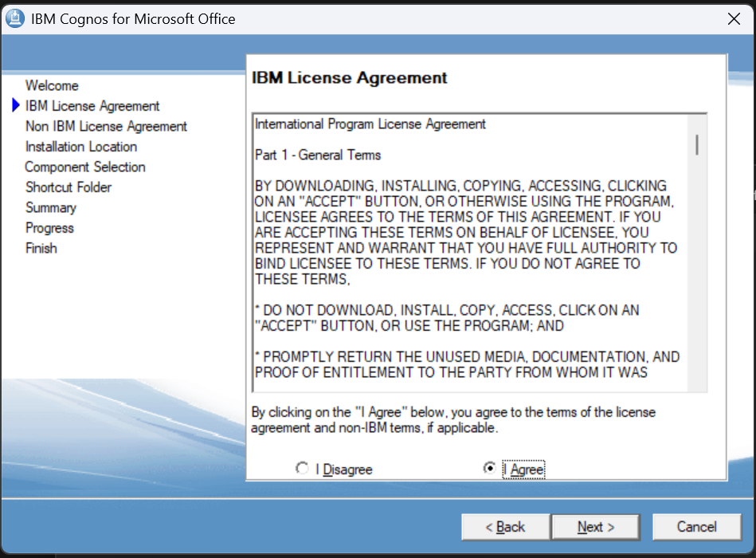
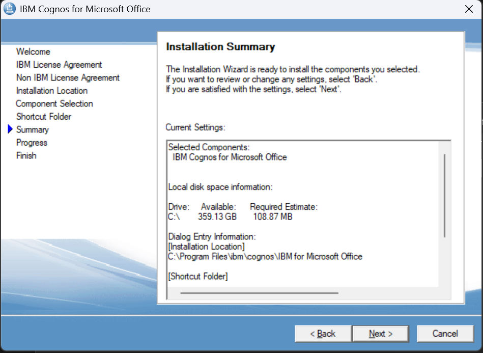
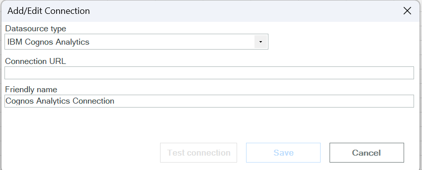

# Lab 3 - Cognos for Microsoft Office Setup

## Overview

This lab will guide you through the installation of **Cognos for Microsoft Office** add-in and how to connect it to your IBM Cognos Analytics account. After completing this lab, you will be able to access Cognos reports and data directly from Microsoft Excel.

---

## Prerequisites

Before starting this lab, ensure you have:

- **Cognos for Microsoft Office installer** - [coc_winx64h_11.0.1.11_ml.tar.gz](../coc_winx64h_11.0.1.11_ml.tar.gz) (available in the project root folder)
- Microsoft Excel installed on your computer
- IBM Cognos Analytics account credentials
- Cognos Analytics URL from your IBM TechZone environment

---

# Part 1: Installation

## Step 1.1: Extract the Installer

Extract the `coc_winx64h_11.0.1.11_ml.tar.gz` file to a folder on your computer.

---

## Step 1.2: Navigate to Setup File

Go to the extracted folder and navigate to:

```
coc_winx64h_11.0.1.11_ml/winx64h/issetup.exe
```

---

## Step 1.3: Run the Installer

Double click `issetup.exe` to start the installation wizard. Choose your preferred language.


---

## Step 1.4: Accept License Agreement

Read and accept the license agreement to proceed with the installation.



---

## Step 1.5: Select Installation Location

Choose the destination folder where Cognos for Microsoft Office will be installed.


---

## Step 1.6: Component Selection

Select the components you want to install. Keep the default selection for standard installation.


---

## Step 1.7: Shortcut Folder

Choose the shortcut folder name for the Start Menu.


---

## Step 1.8: Verify Configuration

Review your installation configuration and make sure everything is correct before proceeding.



---

## Step 1.9: Wait for Installation

Wait until the installation process is complete.


Click **Finish** to complete the installation.

---

# Part 2: Connection Cognos Analytics in Excel

## Step 2.1: Open Excel and Find IBM Menu

Open Microsoft Excel and locate the **IBM** menu on the top menu panel.


---

## Step 2.2: Create New Connection

Click on **Connect** and then select **New Connection** to create a new connection to Cognos Analytics.


---

## Step 2.3: Fill Connection URL and Name

Fill in the **Connection URL** and **Connection Name**.

> **⚠️ Important:** When entering the URL, add `/v1/disp` at the end of your Cognos Analytics URL.
>
> **Format:** `<cognos_url>/v1/disp`
>
> **Example:** `http://region.services.cloud.techzone.ibm.com:12345/bi/v1/disp`



---

## Step 2.4: Test Connection

Click **Test Connection** and make sure the connection is successful.


---

## Step 2.5: Open IBM Cognos Panel

Click **IBM for MS Office** to open the IBM Cognos panel.


---

## Step 2.6: IBM Cognos Panel Appears

The IBM Cognos panel will appear on the right side of your Excel window.


---

## Step 2.7: Expand Project Details

Click the **+** button to see detail projects in your Cognos account.


---

## Step 2.8: Login to Cognos Account

Fill in your Cognos account credentials to connect.


---

## Step 2.9: View Your Cognos Projects

After successful login, you will see all your Cognos folder projects.


---

## Summary

In this lab, you have successfully completed:

✅ **Part 1: Installation** - Installed Cognos for Microsoft Office add-in  
✅ **Part 2: Connection** - Connected Excel to IBM Cognos Analytics

You are now ready to fetch data from Cognos reports and work with them directly in Microsoft Excel.

---

## 🎉 You're Done!

You've successfully setup Cognos for Microsoft Office in IBM Cognos Analytics.

> 💡 Next Steps:
>
> - #### [Continue to Lab 4 - Create Report](https://github.com/Client-Engineering-Indonesia/workshop-cognos-excel/blob/main/6.%20Lab4%20-%20Best%20Practice%20Replacing%20Data%20Source/Lab4.1%20-%20Create%20Report/Lab%204.1%20-%20Create%20Report.md)

---

**Author:** IBM Client Engineering Lab Guide  
**Tool:** IBM Cognos Analytics  
**Tutorial Type:** Cognos for MS Office Setup
**Version:** v1.0  
**Date:** November 2025

## Documentation Info

**Instructor:** IBM Client Engineering Lab Guide  
**Platform:** IBM Cognos Analytics on Cloud  
**Database:** IBM DB2 on Cloud  
**Tools:** Microsoft Excel, Cognos for Microsoft Office Add-in  
**Objective:** Install and configure Cognos for Microsoft Office to enable data integration between Cognos Analytics and Excel
