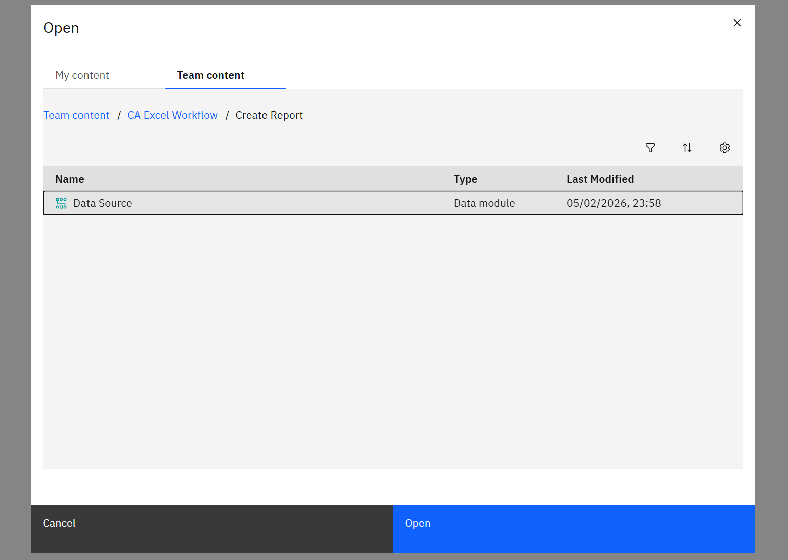
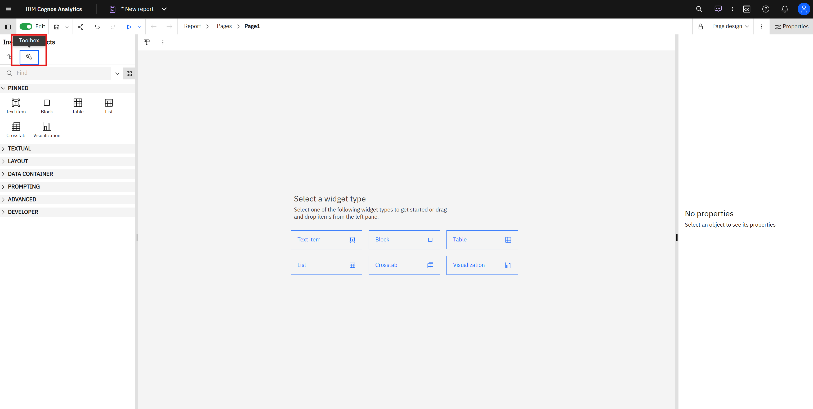

# Lab 3 - Create Report

## Overview

This lab will guide you through creating reports in IBM Cognos Analytics. You will learn how to create a **Data Module** as a data source, build a **Main Report** with filters and crosstab visualization, and optionally create a **Data Source Report** for fetching data to Excel.

---

## Prerequisites

Before starting this lab, ensure you have:

- Access to IBM Cognos Analytics
- Data files ready for upload (Excel/CSV)
- Basic understanding of report structure

---

# Part 1: Create Data Module

The Data Module serves as a **container for data sources** that will be used in your reports.

## Step 0. Below is the data source in xlsx for you to download.

1. [Main_data_sources.xlsx](https://github.com/Client-Engineering-Indonesia/workshop-cognos-excel/blob/main/Assets/Data%20Source/Sample%20Data/Main%20Data%20Sources/Main_Data_Sources.xlsx)

## Step 1.1: Create New Data Module

Click the **Hamburger menu** (☰), then click **New** and select **Data module**.

---

## Step 1.2: Upload Data from Local

Click **Upload from local** to upload your data file.

---

## Step 1.3: Wait for Upload and Save

Wait until the upload is complete, then click **Save** to save your Data Module.

---

## Step 1.4: Locate Your Project Folder

Navigate and select your project folder location to save the Data Module.

> **💡 Note:** Remember this folder location as you will save your reports here as well.

---

# Part 2: Create Main Report

The Main Report is the **primary report used for data analysis and visualization**.

## Step 2.1: Create New Report

Click the **Hamburger menu** (☰), then click **Report** to create a new report.

---

## Step 2.2: Select Report Template

Choose a report template that suits your needs.

---

## Step 2.3: Select Data Source

Click **Select Source** to add a data source for your report.

---

## Step 2.4: Search Data Module

Search for the Data Module you created in Part 1.

---

## Step 2.5: Data Sources Panel

Your data will appear on the **Sources panel** on the left side.

---

## Step 2.6: Open Toolbox Menu

To create report elements, go to the **Toolbox** menu.

---

## Step 2.7: Add Header Text

Drag and drop a **Text item** to the canvas and create your report header.

---

## Step 2.8: Edit Text Properties

To edit your text, go to **Properties** and navigate to **Font & Text** settings.

---

## Step 2.9: Add Filter Table

Add a **Table** that will contain filters for your report.

---

## Step 2.10: Add Value Prompting

Go to **Toolkit** and add **Value prompting** for creating filters.

---

## Step 2.11: Create New Parameter

Create a new **parameter** with a specific name for your filter.

---

## Step 2.12: Choose Package Item

Select the **package item** that will be used to filter. Enable **Make filter optional** if needed.

---

## Step 2.13: Choose Column

Select the column and click **OK**.

---

## Step 2.14: Click Next

Click **Next** to proceed.

---

## Step 2.15: Click Finish

Click **Finish** to complete the filter creation.

---

## Step 2.16: Value Prompt Appears

Your value prompt filter will now appear on the canvas.

---

## Step 2.17: Enable Auto-Submit

> **💡 Tip:** Don't forget to enable **Auto-submit** for automatic refresh when you run your report.

---

## Step 2.18: Create All Filters

Repeat steps 2.10 - 2.16 to create all the filters you need. Your filter setup should look similar to this:

> **💡 Note:** This section can be customized based on your reporting needs. You can add more filters, change filter types, or adjust the layout according to your requirements.

---

## Step 2.19: Create Cross Tab

Drag and drop the **Cross Tab** element to the canvas to display your data.

---

## Step 2.20: Rename Cross Tab

Rename your Cross Tab and click **OK**.

---

## Step 2.21: Add Columns to Cross Tab

Drag and drop the columns you need to the **Cross Tab columns** area.

---

## Step 2.22: Add Rows to Cross Tab

Do the same for rows - drag and drop columns to the **Cross Tab rows** area.

---

## Step 2.23: Preview Report

To preview your report, go to the **Page Design** dropdown and choose **Page Preview**.

---

## Step 2.24: Run Report

To run your report, go to the **top panel** and choose **Run HTML**.

---

## Step 2.25: Filter Your Report

A new tab will open. After running, you can filter your report using the filters you created.

---

## Step 2.26: Save Main Report

Save your main report project and locate it in your project folder (refer to Step 1.4).

---

# Part 3: Create Data Source Report (Optional)

> **💡 Note:** This part is **optional**. The Data Source Report is used to fetch data to Excel and append data. If you update data locally, you may not need this report.

The steps to create a Data Source Report are similar to Part 2 (Steps 2.1 - 2.6). The difference is that you simply **drag and drop the table directly** to the canvas without creating filters or cross tabs.

## Step 3.1: Drag and Drop Table

After setting up your data source (Steps 2.1 - 2.6), drag and drop the **Table** element directly to the canvas.

---

## Step 3.2: Save Data Source Report

Your table will appear on the canvas. Save the report and locate it in your project folder (refer to Step 1.4).

> **💡 Tip:** To preview this report, use the same method as in Part 2 (Steps 2.23 - 2.24).

---

## Summary

In this lab, you have successfully completed:

✅ **Part 1: Create Data Module** - Created a data source container for your reports  
✅ **Part 2: Create Main Report** - Built a report with filters and crosstab visualization  
✅ **Part 3: Create Data Source Report** - (Optional) Created a simple table report for data fetching

You now have all the necessary components for the Cognos and Microsoft Office integration workflow.

---

## Next Steps

Congratulations! You have completed Lab 3 - Create Report:

| Step | Lab                                                                                                                                             | Description                                 |
| :--: | :---------------------------------------------------------------------------------------------------------------------------------------------- | :------------------------------------------ |
|  ✅  | [1. Cognos for MS Office Setup](../Lab%202%20-%20Cognos%20for%20Microsoft%20Office%20Setup/Lab%202%20-%20Cognos%20for%20MS%20Office%20Setup.md) | Cognos for Microsoft Office setup completed |
|  ✅  | **2. Create Report**                                                                                                                            | You are here - Report creation completed    |
|  ➡️  | [3. Update Existing Data Report](https://github.com/Client-Engineering-Indonesia/workshop-cognos-excel/blob/main/5.%20Lab3%20%3A%20Best%20Practice%20Replacing%20Data%20Source/Lab%203.2%20%3A%20Update%20Existing%20Data%20Report/Lab%204%20-%20Update%20Existing%20Data%20Report.md)         | Fetch and append data to Excel              |

---

## Documentation Info

**Instructor:** IBM Client Engineering Lab Guide  
**Platform:** IBM Cognos Analytics on Cloud  
**Database:** IBM DB2 on Cloud  
**Tools:** Microsoft Excel, Cognos for Microsoft Office Add-in  
**Objective:** Create Data Module, Main Report, and Data Source Report in IBM Cognos Analytics
