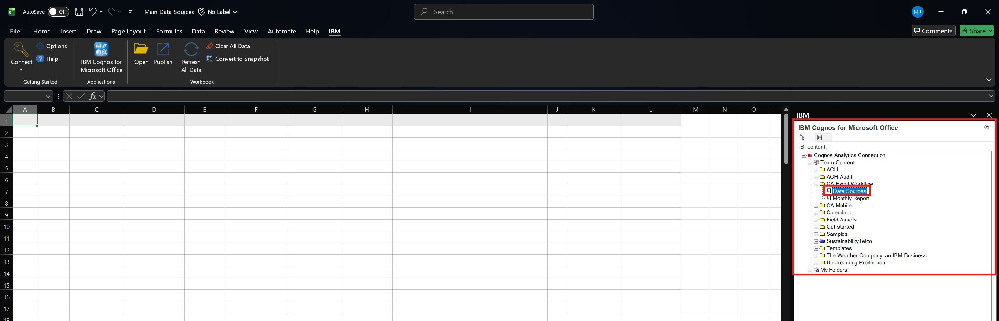
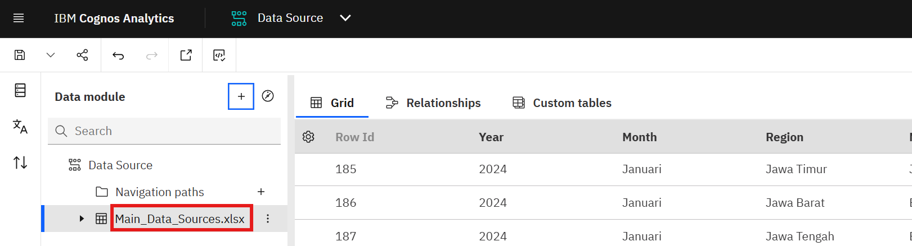
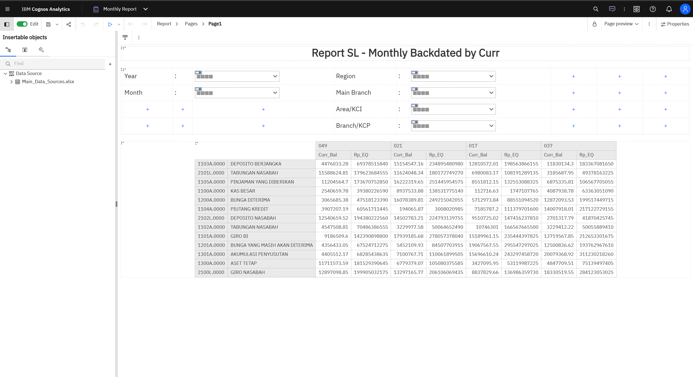

# Lab 4.2 - Update Existing Data Report

## Overview

This lab will guide you through the process of **updating existing data reports** by fetching data from Cognos, appending new data in Excel, and replacing the data source in your Data Module. By the end of this lab, your monthly report will include the newly appended data (e.g., February data).

---

# Part 1: Import and Append Data in Excel

## Step 1.1: Open Report Data Sources Project

Make sure you have the **Report Data Sources Project** that contains all columns matching your Main Report's Data Module.


---

## Step 1.2: Drag and Drop Report to Excel

> **⚠️ Important:** Before proceeding, make sure you have completed [Lab 2 - Cognos for MS Office Setup](../Lab%202%20-%20Cognos%20for%20Microsoft%20Office%20Setup/Lab%202%20-%20Cognos%20for%20MS%20Office%20Setup.md) to establish the connection between Excel and Cognos Analytics.

Find your **Report Data Sources Project** on the IBM Cognos Panel, then drag and drop it to a cell in Excel.



---

## Step 1.3: Fetch Data from Cognos

Your data will be fetched from the Report Data Sources Project and displayed in Excel.


> **💡 Note:** After fetching the data, you can open another Excel file containing new data to append. In this example, we will add **February** data.

---

## Step 1.4: Copy New Data

Open your new data file (e.g., February data) and select all data, then copy it.


---

## Step 1.5: Paste and Append Data

Paste the copied data below your main Excel data sources that you fetched before.


---

## Step 1.6: Save Excel File

Save the Excel file to your local computer.

> **⚠️ Important:** The Excel file name **MUST be the same** as the data source name in your Data Module on Cognos.



### Best Practice: Folder Structure for Monthly Updates

Since the Excel file name must remain the same for each update, it is recommended to create a **separate folder for each month** (or each data update). This ensures you maintain a history of your data updates.

**Recommended Folder Structure:**

```
📁 Cognos Reports/
├── 📁 January Report/
│   └── 📄 Main_Data_Sources.xlsx
├── 📁 February Report/
│   └── 📄 Main_Data_Sources.xlsx
├── 📁 March Report/
│   └── 📄 Main_Data_Sources.xlsx
└── ...
```

> **💡 Tip:** Each time you update/append new data, create a new folder with the month/period name, and save the Excel file with the **exact same name** as the original data source in your Data Module.

---

# Part 2: Replace Data Source in Data Module

## Step 2.1: Open Data Module and Add New Source

Open your **Data Module** project that is referenced by your Report Project. Click **Add New Sources**.


---

## Step 2.2: Upload from Local

Click **Upload From Local** to select your updated Excel file.


> **💡 Note:** Select the Excel file that you updated/appended in Part 1 (e.g., the February Report folder).

---

## Step 2.3: Replace Data and Apply to All Files

> **⚠️ Important:** Make sure to click **Replace data** and **Apply to all Files**. This will replace the existing data source with your updated data.


---

## Step 2.4: Confirm Replacement

Wait until the confirmation pop-up appears and click **OK**.


> **✅ Success:** Your data source in the Data Module has been successfully updated with the new data (including February data).

---

# Part 3: Validation in Main Report Project

## Step 3.1: Open Main Report Project

Open your **Monthly Report Project** (Main Report) to validate the data update.



---

## Step 3.2: Refresh Data Module Source

Right-click on the **Data Module Source** in your Main Report Project, then click **Refresh** to load the newly updated data.


---

## Step 3.3: Run Report to Validate

Run your Main Report Project to validate that the data has been updated.


---

## Step 3.4: Verify Updated Data

Your report data source is now updated and includes **February data**. This confirms the update was successful because initially (as shown in Initial Validation) only January data was available.


---

## Summary

In this lab, you have successfully completed:

✅ **Part 1: Import and Append Data** - Fetched data from Cognos and appended new monthly data in Excel  
✅ **Part 2: Replace Data Source** - Replaced the data source in Data Module with updated Excel file  
✅ **Part 3: Validation** - Verified that the Main Report now includes the newly appended data

You have now learned the complete workflow for updating existing data reports in IBM Cognos Analytics using Microsoft Excel.

---

## 🎉 You're Done!

You've successfully updated existing data report in IBM Cognos Analytics.

> 💡 Next Steps:
>
> - #### [Continue to Lab5 - Turn BI Insights into forecast for Effectivity](https://github.com/Client-Engineering-Indonesia/workshop-cognos-excel/blob/main/7.%20Turn%20BI%20Insights%20into%20forcast%20for%20Effectivity/readme.md)

---

**Author:** IBM Client Engineering Lab Guide  
**Tool:** IBM Cognos Analytics  
**Tutorial Type:** Update Existing Data Report
**Version:** v1.0  
**Date:** November 2025
